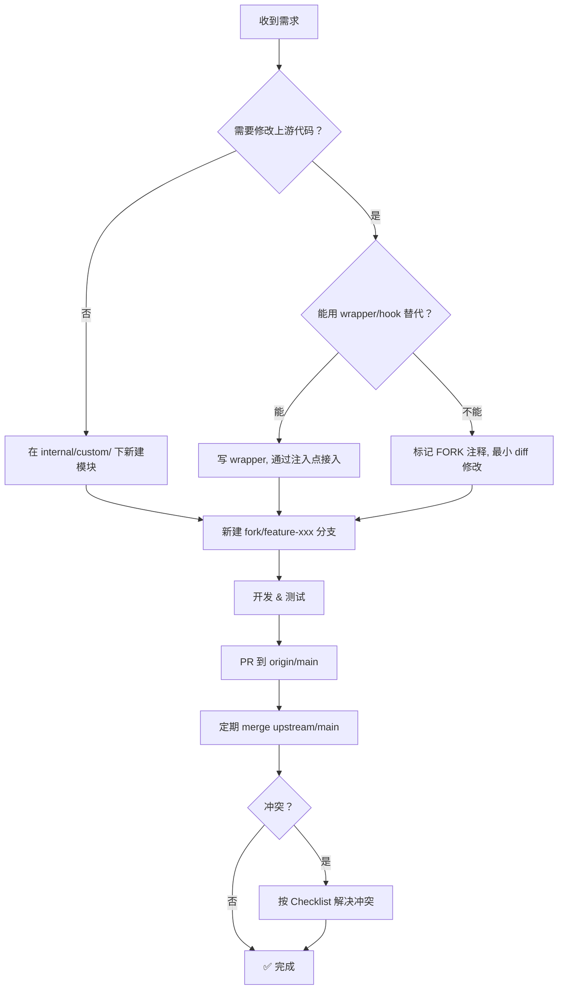

# Sub2API 二次开发（Fork）指南

> 本文档面向在 Sub2API 上游仓库基础上进行二次开发的开发者。
> 核心目标：**最小化对上游代码的修改、最大化新增功能的隔离性**，以降低合并上游更新时的冲突风险。

---

## 一、上游仓库信息

| 项目 | 值 |
|------|------|
| **上游仓库** | [Wei-Shaw/sub2api](https://github.com/Wei-Shaw/sub2api) |
| **你的 Fork** | [pigzwy/sub2api](https://github.com/pigzwy/sub2api) (`origin`) |
| **主分支** | `main` |
| **技术栈** | Go 1.25.7 (Gin + Ent + Wire) / Vue 3.4+ (Vite + TailwindCSS) / PostgreSQL 15+ / Redis 7+ |

### Git Remote 配置

```bash
# 添加上游仓库（只需执行一次）
git remote add upstream https://github.com/Wei-Shaw/sub2api.git

# 验证
git remote -v
# origin    https://github.com/pigzwy/sub2api.git (fetch/push)
# upstream  https://github.com/Wei-Shaw/sub2api.git (fetch/push)
```

---

## 二、分支策略

> [!IMPORTANT]
> **永远不要直接在 `main` 分支上开发自定义功能。** `main` 分支应当始终与上游保持可合并状态。

```
upstream/main ──────────────────────────────►  (上游持续更新)
                    │
                    │ merge
                    ▼
origin/main ────────────────────────────────►  (你的主线, 跟踪上游)
                    │
                    ├── fork/feature-xxx     ← 二开功能分支
                    ├── fork/fix-yyy         ← 二开修复分支
                    └── fork/custom-zzz      ← 二开定制分支
```

### 推荐分支命名规范

| 前缀 | 用途 | 示例 |
|------|------|------|
| `fork/feature-` | 新增功能 | `fork/feature-wechat-pay` |
| `fork/fix-` | 修复 Bug（上游未修的） | `fork/fix-session-leak` |
| `fork/custom-` | 定制化改动 | `fork/custom-branding` |
| `fork/hotfix-` | 紧急修复 | `fork/hotfix-auth-crash` |

### 合并上游的标准流程

```bash
# 1. 拉取上游最新代码
git fetch upstream

# 2. 切到本地 main
git checkout main

# 3. 合并上游 main（推荐 merge，保留历史）
git merge upstream/main

# 4. 如有冲突，解决后提交
git add .
git commit -m "merge: sync upstream/main"

# 5. 推送到 origin
git push origin main

# 6. 将各功能分支 rebase 到最新 main
git checkout fork/feature-xxx
git rebase main
# 解决冲突后 git rebase --continue
```

> [!TIP]
> 主线用 `merge`，功能分支用 `rebase`。这样主线保留完整的上游合并历史，功能分支保持线性整洁。

---

## 三、项目架构速览（冲突热点分析）

理解架构分层是避免冲突的前提。以下标注了每一层的 **冲突风险等级**。

### 后端架构

```
backend/
├── cmd/server/
│   ├── main.go              🔴 入口，上游偶尔改动
│   ├── wire.go              🔴 DI 注册，上游频繁新增 Provider
│   └── wire_gen.go          🔴 自动生成，不要手动编辑
│
├── ent/
│   └── schema/              🟡 数据库 Schema，上游可能新增表/字段
│
├── internal/
│   ├── config/              🟡 配置结构，上游会新增配置项
│   ├── domain/              🟢 领域常量，较稳定
│   ├── handler/             🔴 HTTP 处理器，上游高频修改
│   │   ├── admin/           🔴 管理后台 Handler
│   │   └── wire.go          🔴 Handler DI，上游频繁新增
│   ├── middleware/           🟡 中间件
│   ├── model/               🟡 数据模型
│   ├── repository/          🟡 数据访问层
│   ├── server/
│   │   ├── router.go        🔴 路由总入口
│   │   └── routes/          🔴 路由注册文件，上游频繁新增路由
│   ├── service/             🔴 业务逻辑核心，上游最高频修改区
│   │   └── wire.go          🔴 Service DI
│   └── pkg/                 🟢 工具包，较稳定
│
└── migrations/              🟡 数据库迁移
```

### 前端架构

```
frontend/src/
├── api/                     🟡 API 调用层
├── components/              🟡 通用组件
│   ├── admin/               🔴 管理后台组件，上游频繁修改
│   └── common/              🟢 基础组件
├── composables/             🟢 Composition API hooks
├── i18n/                    🟡 国际化，上游会新增 key
├── router/index.ts          🔴 路由配置，上游频繁新增路由
├── stores/                  🟡 Pinia 状态管理
├── views/
│   ├── admin/               🔴 管理后台页面
│   └── user/                🟡 用户页面
└── styles/                  🟢 样式文件
```

> [!WARNING]
> 🔴 标记的文件/目录是上游高频修改区域，**必须避免直接修改**，否则每次合并上游都会产生冲突。

---

## 四、最小化改动原则

### 原则 1：不修改，只扩展

对于已有功能的定制，**优先通过以下方式实现，而非直接修改上游代码**：

| 策略 | 适用场景 | 示例 |
|------|---------|------|
| **Wrapper / Decorator** | 需要在已有逻辑前后插入行为 | 包装 `GatewayService` 添加请求日志 |
| **新文件 + 注入点** | 需要新增独立模块 | 新建 `custom_xxx_service.go` |
| **配置开关** | 条件性启用/禁用功能 | `config.yaml` 新增 `custom:` 段 |
| **Interface 实现替换** | 替换某个组件的行为 | 自定义 `BillingService` 实现 |

### 原则 2：改动上游文件时，集中在文件末尾

如果 **不得不** 修改上游文件（例如 `router.go`、`wire.go`），遵循以下规则：

```go
// ========== 上游原始代码 ==========
// ... 保持原样 ...

// ========== [FORK] 二开扩展 - 开始 ==========
// 所有二开代码集中在文件末尾
// 添加注释标记，方便合并时定位
// ========== [FORK] 二开扩展 - 结束 ==========
```

> [!IMPORTANT]
> 每一处对上游文件的修改 **必须** 用 `[FORK]` 标记注释。这是合并冲突时快速定位和保留二开代码的关键。

### 原则 3：如果必须修改上游函数，用最小 diff

```go
// ❌ 错误：重写整个函数
func (s *GatewayService) HandleRequest(ctx context.Context, req *Request) (*Response, error) {
    // 完全重写了 200 行...
}

// ✅ 正确：只在必要位置插入钩子
func (s *GatewayService) HandleRequest(ctx context.Context, req *Request) (*Response, error) {
    // [FORK] 二开：请求预处理钩子
    if s.customPreHook != nil {
        if err := s.customPreHook(ctx, req); err != nil {
            return nil, err
        }
    }

    // ... 上游原始逻辑保持不变 ...

    // [FORK] 二开：响应后处理钩子
    if s.customPostHook != nil {
        resp = s.customPostHook(ctx, resp)
    }
    return resp, nil
}
```

---

## 五、新增功能的冲突规避模式

### 5.1 后端：新增独立 Package

**最推荐** 的方式：将二开功能放在独立的 package 中。

```
backend/internal/
├── service/                  ← 上游目录，不动
├── handler/                  ← 上游目录，不动
│
├── custom/                   ← 🆕 二开专用顶级目录
│   ├── wechat_pay/           ← 独立功能模块
│   │   ├── service.go
│   │   ├── handler.go
│   │   └── wire.go
│   ├── custom_billing/       ← 自定义计费逻辑
│   │   ├── service.go
│   │   └── wire.go
│   └── README.md             ← 二开模块说明
```

**优势**：
- 上游永远不会在 `internal/custom/` 下创建文件 → **零冲突**
- 模块边界清晰，可独立测试
- 合并上游时只需处理 **注入点**（wire.go、router.go）的少量冲突

### 5.2 后端：路由注册

> [!CAUTION]
> `routes/` 目录下的文件（`admin.go`、`gateway.go`、`auth.go`、`user.go`）是上游高频修改区，**不要在这些文件中间插入代码**。

**推荐做法**：新建独立路由文件。

```go
// backend/internal/server/routes/custom.go  ← 🆕 新文件
package routes

import (
    "github.com/gin-gonic/gin"
    "github.com/Wei-Shaw/sub2api/internal/custom/wechat_pay"
)

// RegisterCustomRoutes 注册所有二开路由
// [FORK] 二开扩展
func RegisterCustomRoutes(r *gin.Engine, v1 *gin.RouterGroup, deps *CustomRouteDeps) {
    // 微信支付路由
    pay := v1.Group("/custom/pay")
    {
        pay.POST("/notify", deps.WechatPay.HandleNotify)
        pay.GET("/status/:id", deps.WechatPay.GetPaymentStatus)
    }

    // 其他二开路由...
}

type CustomRouteDeps struct {
    WechatPay *wechat_pay.Handler
}
```

然后在 `router.go` 的 `registerRoutes` 函数 **末尾** 添加一行调用：

```go
func registerRoutes(...) {
    // ... 上游原有路由注册 ...

    // [FORK] 注册二开路由
    routes.RegisterCustomRoutes(r, v1, customDeps)
}
```

### 5.3 后端：Wire DI 注入

Wire 是冲突最密集的环节。策略：

```go
// backend/internal/custom/wire.go  ← 🆕 新文件
package custom

import "github.com/google/wire"

// ProviderSet 二开功能的 Wire Provider 集合
var ProviderSet = wire.NewSet(
    wechat_pay.NewService,
    wechat_pay.NewHandler,
    // ... 其他二开模块 ...
)
```

在 `cmd/server/wire.go` 中只需新增 **一行**：

```go
func initializeApplication(buildInfo handler.BuildInfo) (*Application, error) {
    wire.Build(
        config.ProviderSet,
        repository.ProviderSet,
        service.ProviderSet,
        middleware.ProviderSet,
        handler.ProviderSet,
        server.ProviderSet,

        // [FORK] 二开功能 Provider
        custom.ProviderSet,

        // ... 其余保持不变 ...
    )
    return nil, nil
}
```

> [!TIP]
> 将所有二开模块的 Provider 聚合到一个 `custom.ProviderSet` 中。这样无论新增多少模块，`wire.go` 的改动始终只有一行——**极大降低合并冲突概率**。

### 5.4 后端：Ent Schema 扩展

#### 新增表（推荐）

直接在 `ent/schema/` 下新建文件，用 `custom_` 前缀命名：

```go
// backend/ent/schema/custom_payment.go  ← 🆕 新文件
package schema

import (
    "entgo.io/ent"
    "entgo.io/ent/schema/field"
)

type CustomPayment struct {
    ent.Schema
}

func (CustomPayment) Fields() []ent.Field {
    return []ent.Field{
        field.String("order_id").Unique(),
        field.Float("amount"),
        field.String("status"),
        // ...
    }
}
```

> 新增 schema 文件后必须执行 `go generate ./ent` 重新生成 Ent 代码，并提交生成的文件。

#### 给已有表加字段（高风险）

> [!WARNING]
> 给上游已有的表加字段（如 `user.go`、`account.go`）**冲突风险极高**。上游也会频繁增删字段。

**替代方案**：新建关联表存储扩展字段。

```go
// 用独立的扩展表 代替 直接修改 user schema
type CustomUserProfile struct {
    ent.Schema
}

func (CustomUserProfile) Fields() []ent.Field {
    return []ent.Field{
        field.Int("user_id").Unique(), // 关联 user 表
        field.String("wechat_openid").Optional(),
        field.String("custom_field").Optional(),
    }
}
```

### 5.5 前端：新增页面与组件

#### 目录隔离

```
frontend/src/
├── views/
│   ├── admin/               ← 上游目录
│   ├── user/                ← 上游目录
│   └── custom/              ← 🆕 二开页面目录
│       ├── WechatPayView.vue
│       └── CustomDashboard.vue
│
├── components/
│   ├── admin/               ← 上游目录
│   └── custom/              ← 🆕 二开组件目录
│       ├── PaymentForm.vue
│       └── CustomChart.vue
│
├── api/
│   ├── auth.ts              ← 上游文件
│   └── custom.ts            ← 🆕 二开 API 调用
│
├── stores/
│   ├── auth.ts              ← 上游文件
│   └── customPay.ts         ← 🆕 二开 Store
```

#### 路由注册

`router/index.ts` 是高频冲突文件。策略：将二开路由定义在独立文件中。

```typescript
// frontend/src/router/customRoutes.ts  ← 🆕 新文件
import type { RouteRecordRaw } from 'vue-router'

export const customRoutes: RouteRecordRaw[] = [
  {
    path: '/custom/pay',
    name: 'CustomPay',
    component: () => import('@/views/custom/WechatPayView.vue'),
    meta: {
      requiresAuth: true,
      requiresAdmin: true,
      title: 'Payment Management',
    }
  },
  // ... 其他二开路由
]
```

在 `router/index.ts` 中只需在路由数组末尾（404 路由之前）加一行展开：

```typescript
import { customRoutes } from './customRoutes'

const routes: RouteRecordRaw[] = [
  // ... 上游路由保持不变 ...

  // [FORK] 二开路由
  ...customRoutes,

  // ==================== 404 Not Found ====================
  { path: '/:pathMatch(.*)*', ... }
]
```

### 5.6 前端：国际化 (i18n)

使用独立的 namespace 避免与上游 i18n key 冲突：

```typescript
// frontend/src/i18n/locales/zh-CN/custom.ts  ← 🆕 新文件
export default {
  custom: {
    pay: {
      title: '支付管理',
      orderList: '订单列表',
      // ...
    }
  }
}
```

### 5.7 配置扩展

在 `config.yaml` 中使用独立的顶级 key：

```yaml
# 上游配置保持不变
server:
  port: 8080
database:
  host: localhost

# [FORK] 二开配置 - 使用独立命名空间
custom:
  wechat_pay:
    app_id: "wx1234567890"
    mch_id: "1234567890"
    notify_url: "https://example.com/api/v1/custom/pay/notify"
  feature_flags:
    enable_custom_billing: true
    enable_wechat_login: false
```

对应后端 Config 结构：

```go
// backend/internal/config/custom.go  ← 🆕 新文件
package config

type CustomConfig struct {
    WechatPay    WechatPayConfig    `yaml:"wechat_pay"`
    FeatureFlags FeatureFlags       `yaml:"feature_flags"`
}

type WechatPayConfig struct {
    AppID     string `yaml:"app_id"`
    MchID     string `yaml:"mch_id"`
    NotifyURL string `yaml:"notify_url"`
}

type FeatureFlags struct {
    EnableCustomBilling bool `yaml:"enable_custom_billing"`
    EnableWechatLogin   bool `yaml:"enable_wechat_login"`
}
```

在主 Config 结构中只需加一行：

```go
type Config struct {
    // ... 上游字段 ...

    // [FORK] 二开配置
    Custom CustomConfig `yaml:"custom"`
}
```

---

## 六、合并上游代码时的 Checklist

每次合并上游代码后，按以下清单逐项检查：

### 必检项

- [ ] `go generate ./ent` — 如果上游修改了 ent schema
- [ ] `go generate ./cmd/server` — 如果上游修改了 wire.go
- [ ] `go build -tags embed ./cmd/server` — 编译通过
- [ ] `go test -tags=unit ./...` — 单元测试通过
- [ ] `golangci-lint run ./...` — 无新增 lint 问题
- [ ] `cd frontend && pnpm install` — 如果上游修改了 package.json
- [ ] `pnpm build` — 前端构建通过

### 高频冲突文件及处理策略

| 文件 | 冲突原因 | 处理策略 |
|------|---------|---------|
| `cmd/server/wire.go` | 上游新增 Provider | 保留上游新增，确保 `custom.ProviderSet` 仍在 |
| `cmd/server/wire_gen.go` | 自动生成 | 解决 wire.go 冲突后重新 `go generate` |
| `internal/handler/wire.go` | 上游新增 Handler | 保留上游新增 |
| `internal/server/router.go` | 上游修改路由逻辑 | 保留上游修改，确保二开调用仍在末尾 |
| `internal/server/routes/*.go` | 上游新增路由 | 保留上游修改（二开路由在独立文件） |
| `frontend/src/router/index.ts` | 上游新增路由 | 保留上游修改，确保 `...customRoutes` 仍在 |
| `ent/schema/*.go` | 上游新增/修改 schema | 保留上游修改（二开用 `custom_` 前缀文件）|
| `frontend/pnpm-lock.yaml` | 依赖更新 | 删除后重新 `pnpm install` 生成 |

### 冲突解决的黄金规则

> **上游代码优先。** 冲突时先接受上游的改动，然后在其基础上重新应用二开代码。
> 永远不要为了保留二开代码而丢弃上游的更新。

---

## 七、常见反模式 ⚠️

### ❌ 反模式 1：在上游文件中间大量插入代码

```go
// ❌ 在 gateway_service.go 的第 500 行插入 100 行自定义逻辑
// 后果：上游每次修改 gateway_service.go 都会产生冲突
```

**正确做法**：新建 `custom_gateway_extension.go`，通过组合/钩子方式扩展。

### ❌ 反模式 2：修改上游的 interface 定义

```go
// ❌ 给 service.AccountRepository interface 新增方法
// 后果：所有实现该 interface 的 struct（包括 test stub）都要改，大面积冲突
```

**正确做法**：定义新的 interface，通过类型断言可选调用。

```go
// ✅ 新建独立 interface
type CustomAccountExtension interface {
    GetWechatBinding(ctx context.Context, userID int) (string, error)
}

// 使用时通过类型断言
if ext, ok := repo.(CustomAccountExtension); ok {
    openid, _ = ext.GetWechatBinding(ctx, userID)
}
```

### ❌ 反模式 3：重命名上游的文件或函数

```
# ❌ 把 gateway_handler.go 改名为 gateway_handler_v2.go
# 后果：Git 无法追踪重命名，合并时产生双份文件
```

### ❌ 反模式 4：修改上游的 go.mod module path

```
# ❌ 把 module github.com/Wei-Shaw/sub2api 改成 github.com/pigzwy/sub2api
# 后果：所有 import 路径都要跟着改，每个文件都会冲突
```

**正确做法**：保持 `go.mod` 的 module path 与上游一致。

### ❌ 反模式 5：在 main 分支上直接开发

```
# ❌ git checkout main && 直接修改代码 && git commit
# 后果：main 分支与上游 diverge，合并变得越来越困难
```

---

## 八、二开代码的文件命名约定

为了在文件系统层面一眼识别二开代码，统一使用以下命名约定：

| 位置 | 命名规则 | 示例 |
|------|---------|------|
| 后端新文件 | `custom_*.go` | `custom_payment_service.go` |
| 后端新 package | `internal/custom/` | `internal/custom/wechat_pay/` |
| 前端新文件 | 放在 `custom/` 子目录 | `views/custom/PayView.vue` |
| 路由文件 | `custom.go` / `customRoutes.ts` | — |
| i18n | `custom.ts` / `custom.json` | — |
| Ent Schema | `custom_*.go` | `custom_payment.go` |
| 配置 | `custom:` 命名空间 | `config.yaml` 中 `custom:` |
| 数据库迁移 | `YYYYMMDD_custom_*.sql` | `20260407_custom_add_payment.sql` |

---

## 九、推荐的开发工作流



---

## 十、快速参考命令

```bash
# ===== Git 操作 =====
git fetch upstream                          # 拉取上游
git merge upstream/main                     # 合并上游到当前分支
git rebase main                             # 功能分支 rebase 到最新 main

# ===== 后端 =====
cd backend
go generate ./ent                           # 重新生成 Ent 代码
go generate ./cmd/server                    # 重新生成 Wire 代码
go build -tags embed ./cmd/server           # 编译（含前端）
go test -tags=unit ./...                    # 单元测试
go test -tags=integration ./...             # 集成测试
golangci-lint run ./...                     # Lint 检查

# ===== 前端 =====
cd frontend
pnpm install                                # 安装依赖
pnpm dev                                    # 开发服务器
pnpm build                                  # 构建

# ===== 查找二开代码 =====
grep -rn "\[FORK\]" backend/                # 查找所有二开标记
grep -rn "\[FORK\]" frontend/src/           # 查找前端二开标记
```
